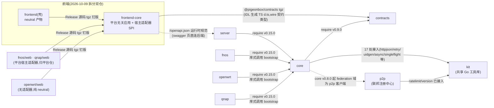
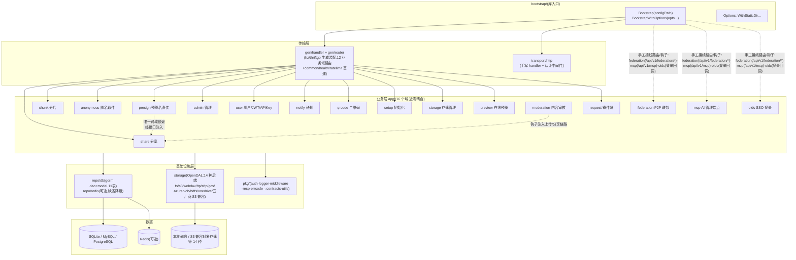
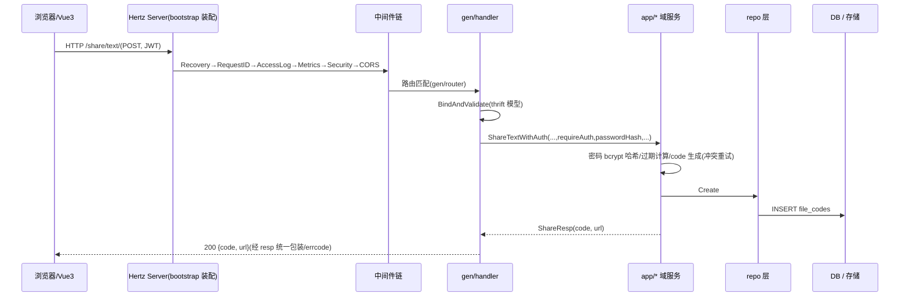
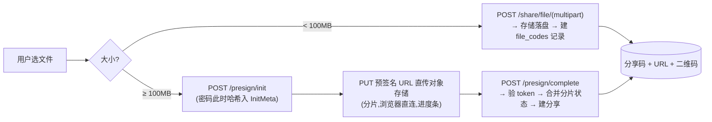
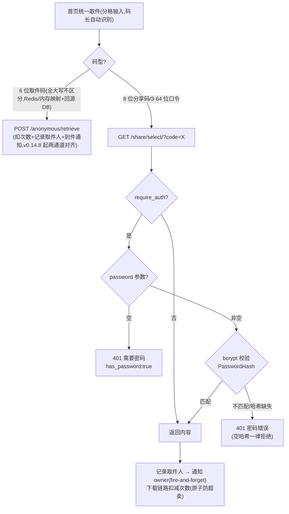
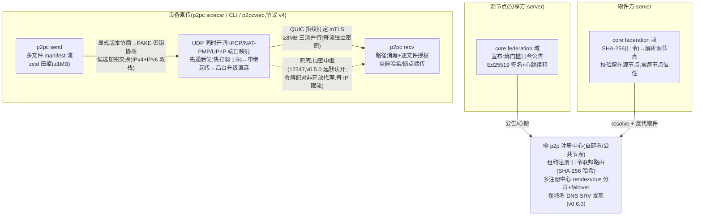
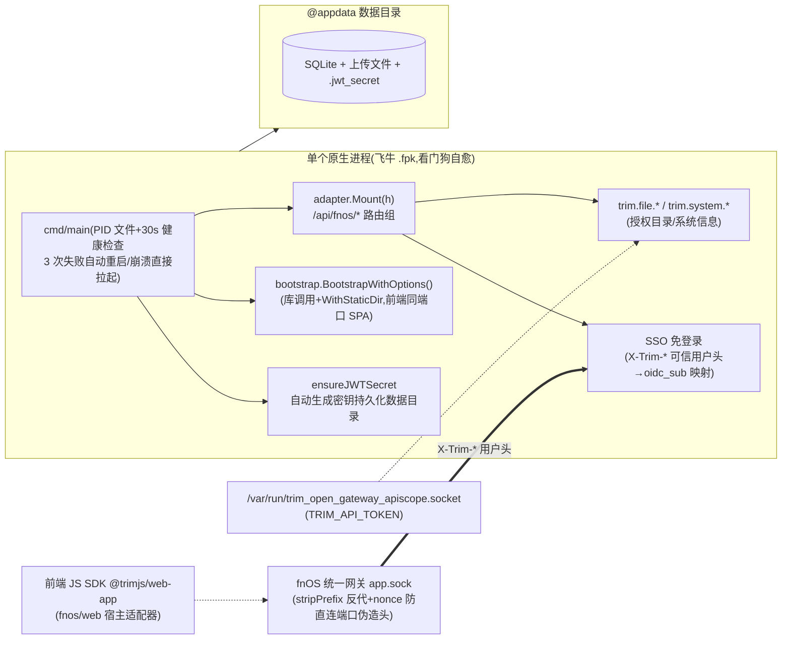
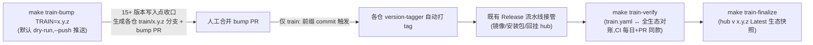
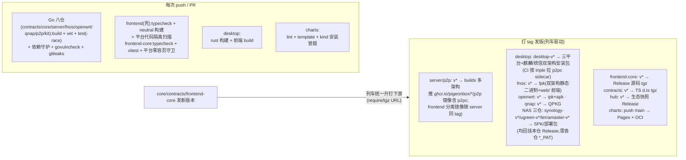

# PigeonBox 架构文档

> 装配仓的架构总览:生态全景、仓库依赖、core 内部分层、运行时请求流、数据流、部署形态与发布流水线。
> 所有图均为 Mermaid,GitHub 原生渲染。版本与仓库角色速查见 [README](../README.md)。

---

## 1. 生态全景

```mermaid
graph TB
    subgraph ORG["pigeonbox 组织"]
        UMB["📁 pigeonbox<br/>(装配仓·本仓库)<br/>make setup 拉齐工作区<br/>release/train.yaml 版本真相源"]
        CT["📦 contracts<br/>契约层 v0.9.0<br/>errcode + Thrift 类型 + IDL 真相源"]
        CORE["🧩 core<br/>业务核心库 v0.15.0<br/>16 域服务 + bootstrap"]
        SRV["🚀 server<br/>部署应用 v0.15.9<br/>main 薄壳 + pb CLI + Dockerfile"]
        FE["🖥️ frontend<br/>前端壳 v0.15.9<br/>neutral 产物 + nginx 分离镜像"]
        FEC["🎨 frontend-core<br/>公共前端 core v0.1.5<br/>平台无关应用 + 宿主适配器 SPI"]
        FNOS["🐂 fnos<br/>飞牛 fnOS 原生应用 v1.15.0<br/>fpk 单进程 + 开放平台 SSO 深度融合"]
        OWRT["📡 openwrt<br/>OpenWrt/iStoreOS ipk+apk v1.15.0<br/>procd 托管/UCI 配置/LuCI"]
        QNAP["🗄️ qnap<br/>威联通 QTS 原生 QPKG v1.15.0<br/>SSO 免登录 + 看门狗自愈"]
        NAS3["📦 NAS 打包三仓 v1.15.0<br/>synology SPK(compose 壳)<br/>ugreen · terramaster 部署包"]
        P2P["🕸️ p2p<br/>联邦注册中心 v0.6.0<br/>租约注册/联邦路由/WS 信令/设备直传"]
        KIT["🧰 kit<br/>共享 Go 工具库 v0.3.1<br/>retry/syncx/shutdown/workflow 等 28 包"]
        DESK["💻 desktop<br/>Tauri 桌面客户端 desktop-v1.15.0<br/>p2pc sidecar 设备直传"]
        CHT["☸️ charts<br/>Helm Chart 2.0.7<br/>Pages + OCI 双发布"]
    end

    USER["👤 自托管用户"] -->|"compose / Helm"| SRV
    NAS["🏠 飞牛 NAS 用户"] -->|".fpk 原生应用"| FNOS
    RT["📡 路由器 / iStoreOS 用户"] -->|".ipk / .apk 一键安装"| OWRT
    QNU["🏠 威联通用户"] -->|".qpkg 原生应用(免 Docker)"| QNAP
    NASU["🏠 群晖/绿联/铁威马用户"] -->|"SPK / compose 导入"| NAS3
    DEV["👨‍💻 开发者"] -->|"git clone + make setup"| UMB

    UMB -.->|"setup.sh 拉取"| CT & CORE & SRV & FE & FEC & FNOS & OWRT & QNAP & P2P & KIT & NAS3
    DESK -.->|"HTTP API 连接任意服务器"| SRV
    CHT -.->|"Helm 编排前后端分离栈"| SRV
    NAS3 -.->|"打包官方镜像(零 Go 代码)"| SRV
```



**职责边界**:装配仓不含业务代码,只提供工作区装配(`setup.sh`/`go.work`/`Makefile`/`docker-compose.yml`)、发布列车(`release/train.yaml` + `make train-*`)与文档站;十三个模块仓库(经 setup.sh 拉取,含 NAS 打包四仓 synology/qnap/ugreen/terramaster——其中 qnap 已切原生 QPKG 含 Go 代码,其余三仓为纯 shell compose 壳)与 desktop(桌面客户端,Rust 项目不入 go.work)、charts(Helm Chart)两个产物仓独立开发、独立 CI、独立发版。

---

## 2. 仓库依赖关系

### 2.1 依赖图(构建期,单向无环)



desktop 不进 go.work(Rust 项目),经 HTTP API 连接任意 PigeonBox 服务器,无构建期依赖;p2pc sidecar 二进制由 p2p 仓 Release 按 Tauri target triple 提供。

> 图中钉版为 1.15.0 列车(`release/train.yaml`)声明值,由 `make train-bump` 统一写入各仓 go.mod/VERSION/manifest——禁止绕过列车手改钉版(见 §7)。

### 2.2 依赖规则(CI 强制守护)

| 规则 | 守护方式 |
|------|---------|
| contracts 零项目内依赖(纯类型,仅 thrift runtime + 标准库) | contracts CI:`go list -deps` 检查 |
| kit 零生态依赖(禁 import 任何兄弟模块);p2p 业务链零依赖(kit 地基层放行) | kit / p2p CI dep guard:`go list -deps` 检查 |
| core 不许 import server / frontend / fnos | core CI 同上 |
| server / fnos 只经 go.mod 正式版本引用 core,**零 replace** | 各仓 go.mod 无 replace(本地联编由本仓 go.work 承担) |
| frontend wire 契约类型经 `@pigeonbox/contracts`(contracts IDL 生成的 TS d.ts,Release tgz 资产依赖);运行时 `/openapi.json` 仍是 API 规范真相源,快照不维护 | contracts CI `--check` 对账生成物;swagger 页与 vite 代理均直连后端同源(2026-10-04 移除漂移快照) |
| frontend-core 平台无关:源码禁引任何宿主 SDK,运行时依赖精确钉版随 tgz 传递解析;**宿主适配器归各平台仓 `web/`**(fnos/qnap),新增平台零改动 frontend-core | frontend-core CI 平台零容忍守卫(依赖清单/源码扫描/neutral 产物扫描);壳仓 CI 平台代码隔离扫描 |

### 2.3 版本矩阵

| 仓库 | 当前版本 | 说明 |
|------|---------|------|
| contracts | v0.10.0 | thrift v0.13 生成代码,版本约束以 require 传递(下游零 replace);IDL 真相源 `idl/`,前端 TS 类型经 `cmd/gen-ts` → Release tgz;**v0.9.0=寄件码域 IDL 化(request.thrift)+用户分享组/notify mine 契约增量**(非 admin 面路由全部收敛 IDL);另有 `cmd/gen-openapi`(IDL→openapi.json,core embed) |
| core | v0.15.2 | 16 域服务;**v0.15.0=寄件码域 IDL 化收编(gen/router/request)+文本分享与文件分享同权铸造 6 位取件码(文本取件链路)+页脚管理入口缺省展示(show_admin_addr 改 *bool)+依赖地板抬升(x/net v0.60.0/toolchain 1.26.9)**;**v0.14.0=单机内存模式(redis.host 空=进程内 KV,回源 DB+负缓存防穿透;public/admin 缺 Redis fail-fast)**;v0.13.0=PB_DEPLOY_MODE 三模式部署拆分(standalone/public×N/admin×1,Redis 配置广播)+回收站;v0.14.9=env 前缀 FCB_→PB_ 全量更名+存储洞察/孤儿清理幽灵端点补实现(/admin/storage/insights·clean-presign-orphans)+两波攻击面加固(HSTS 三态/presign Complete 后重放覆盖/分片数硬上限/OIDC 封禁拒发/IdentityFresh 身份复核);v0.14.8=取件历史双修复(分页 total 失真+6位码通道补记取件人与到件通知——此前仅 8位码链路记录)+取件码大小写折叠(download.code_case_insensitive 默认开);v0.11.x=HttpOnly Cookie 会话(CSRF 头门禁)+审计清欠+攻击面收缩;v0.10.0=全面安全审计加固(管理面/chunk 链路/JWT 纪元·封禁改密即时失效/纵深防御);v0.9.0=federation M4(registry 多主备 failover+心跳短退避);v0.8.x=federation 接入+kit 化;v0.7.x=API Token/多文件+zip/OIDC/寄件码/运行时 OpenAPI |
| frontend | v0.15.9(随列车,与 server 同 `v*` tag) | 前端壳(2026-10-09 拆分双仓):只做 **neutral 产物**(零平台代码,供 server/docker 镜像)+dev/typecheck;运行时依赖经 frontend-core 精确钉版传递;自带 Dockerfile(nginx-unprivileged 静态+反代),镜像 `ghcr.io/pigeonbox/frontend` 随 server 同 tag 发布;平台宿主适配器已迁出至 fnos/qnap 各仓 `web/` |
| frontend-core | v0.1.8 | 公共前端 core(2026-10-09 拆分):平台无关应用全量(视图/stores/API/i18n/组件/单测)+宿主适配器 SPI(`src/host`,installHost 运行时注入);消费=Release 源码 tgz(与 contracts 同模式,壳仓与各平台仓 `web/` 以 URL 依赖钉版);CI 平台零容忍守卫(依赖清单/源码禁宿主 SDK,neutral 产物扫描) |
| server | v0.15.11 | **v0.15.x=单机内存模式列车(core v0.14.0)**;v0.14.x=多副本拆分列车(core v0.13.0,PB_DEPLOY_MODE);纯后端镜像(默认 release 模式,alpine 钉 3.22);frontend 分离镜像由同一 `v*` tag 同步发布(`ghcr.io/pigeonbox/server` / `frontend`) |
| fnos | v1.15.4(内置 core v0.15.2) | 原生 fpk(包内自带双架构二进制+前端,hub Release `fnos-v*`);镜像 `ghcr.io/pigeonbox/fnos` 已停发(2026-10-09 Docker 链路移除,冻结在 v1.14.6;旧镜像 `pigeonbox-fnos` 冻结在 v0.2.6,更早 `pigeonbox-fnos` 冻结在 v0.2.1) |
| openwrt | v1.15.4(内置 core v0.15.2) | OpenWrt/iStoreOS 原生 ipk:procd 托管,UCI 配置(`/etc/config/pigeonbox`)+drop-in config.yaml,双架构 x86_64/aarch64_generic;ipk 回挂 hub Release(`openwrt-v*`) |
| qnap | v1.15.4(原生,内置 core v0.15.2) | 威联通 QTS 原生 QPKG(v1.14.4 起切原生进程模式,对齐 fnos):包内自带双架构静态二进制+前端,单进程单端口,免 Container Station(QTS 4.5+);QPKG 服务脚本托管(setsid 后台引导+PID+看门狗自愈),.env 在卷根 pigeonbox/;QDK qbuild 组包,包回挂 hub Release(`qnap-v*`) |
| NAS 打包三仓 | v1.15.4(钉 server/frontend 镜像 v0.15.11) | synology SPK(noarch,DSM 7.2+ Container Manager)/ ugreen·terramaster compose 部署包(UPK/TOS7 应用包送审二期);纯 shell 零 Go,编排=双容器免 Redis;共享模板在 hub `deploy/nas/`(qnap 原生切出后不消费);包回挂 hub Release(各 `*-v*` tag) |
| p2p | v0.6.0 | v0.3.x=M3 设备直传全量(p2pc)+六平台二进制;v0.4.0=wire AEAD/注册 token/中继限流安全加固;v0.4.10=env 前缀 PB_ 更名;**v0.5.0=安全运营加固(XFF 末段解析/per-hash 限流/TLS/快照持久化/原生 fuzz)+传输协议 v3(显式版本协商+QUIC ≥8MB 三流并行)**;**v0.6.0=传输协议 v4(多文件 manifest 流+zstd 压缩+单遍哈希)+健壮性三件套(IPv6 双栈/PCP·NAT-PMP·UPnP 端口映射/先通后优)+发现层(DNS SRV+多注册中心 rendezvous 分片 failover)+p2pcweb 网页模式多文件+中继默认开**;协议 v3/v4 为破坏性变更,直传双端须同版;镜像 `ghcr.io/pigeonbox/p2p`(含 p2pc) |
| kit | v0.3.1 | 共享 Go 工具库(28 包);已被 core(17 处)、p2p(ratelimit)、fnos/server(version) 消费;纯库仓无镜像,`go get github.com/pigeonbox/kit/<包名>` |
| desktop | desktop-v1.15.4 | Tauri 2 桌面客户端+**p2pc sidecar 设备直传**(sidecar 钉 p2pc v0.6.0,传输协议 v4——破坏性变更,与旧版互传须双端同版);三平台安装包+麒麟/统信双架构(arm64 glibc ≤2.35 守卫)回挂本仓 Release(`desktop-v*` tag) |
| charts | chart 2.0.9(app v0.15.11) | `pigeonbox` chart:1.2.x 起内置数据面,1.3.x 增内置 S3(SeaweedFS),1.3.4 增 p2p 可选组件,1.3.7 增直传中继开关,**1.3.22 增多副本双拓扑(PB_DEPLOY_MODE)**;Pages + OCI 双发布 |

---

## 3. core 内部分层架构



**分层纪律**(继承原 internal 设计):业务层不依赖传输协议、不直接操作数据库(经 repo);域与域之间不互相 import(presign→share 唯一例外,经接口注入;moderation 以钩子注入,不算 import)。

> 域到路由的两种挂法:share/chunk/preview/request 等走 gen 生成路由(request 寄件码域自 core v0.15.0 IDL 化收编,非 admin 面路由已全部收敛 IDL);federation/mcp/oidc 在 bootstrap 手工注册(mcp 为 JSON-RPC 2.0 单端点,非 REST)。

### 3.1 全局中间件链(顺序敏感)

```
Recovery → RequestID → AccessLog → Metrics → SecurityHeaders → CORS → handler
(panic→500) (trace_id)  (结构化日志) (RED指标)  (安全响应头)     (跨域)
```

Metrics 默认绑定 `127.0.0.1:9090`(可用 `PB_METRICS_ADDR` 配置),仅供同节点 Prometheus 抓取。

SecurityHeaders 的 HSTS 为三态语义(conf 层裁决):未配置时生产模式默认开启、开发默认关,`security.cors.enable_hsts` 显式值恒以配置为准(env `PB_ENABLE_HSTS`)。业务指标名前缀 `pb_`(如 `pb_upload_bytes_total`),Redis 键前缀 `pb:`。

---

## 4. 运行时请求流



**关键路径**:`/live` `/ready` 健康检查、`/metrics` Prometheus、静态资源(StaticDir 选项,SPA fallback)均在 bootstrap 层注册,不经过业务。另有 `POST /api/v1/mcp` 单端点(JSON-RPC 2.0,管理员 token)供 AI 客户端(Claude Desktop 等)执行建分享/查询/清理等管理操作。

---

## 5. 关键数据流

### 5.1 文件上传(双路径)



### 5.2 取件与密码保护



> 取件码通道(v0.14.8 起)与 8 位码链路的取件人记录/到件通知行为完全一致:
> `RecordViewerAndNotify` 统一收口,同 code 5 分钟内通知去重。
> v0.15.0 起文本分享与文件分享**同权铸造 6 位取件码**,文本取件走同一 `/anonymous/retrieve` 链路。

### 5.3 P2P 联邦与设备直传(可选,联邦默认关)



### 5.4 飞牛 fnOS 形态(原生单进程库式调用)



包内自带双架构静态二进制与前端产物(`app/www`),不依赖 Docker/外网拉镜像。非 fnOS 环境(探测不到网关凭证)自动**降级**为普通单机服务器:`/api/fnos/*` 不可用,业务全部正常;通知中心/内网穿透官方一期未开放,诚实缺席不造假开关。威联通 qnap 仓为同构形态(QTS 原生 QPKG,SSO 信任锚=本机 `authLogin.cgi` 实时校验 `NAS_SID` 会话,详见 qnap README)。

---

## 6. 部署形态对比

| | server(自托管) | fnos(飞牛) | openwrt(路由器) | qnap(威联通) | desktop(桌面) |
|---|---|---|---|---|---|
| 进程 | 1 个二进制(main → core) | 1 个原生进程(main → core,看门狗自愈) | 1 个二进制(core,procd 托管+开机自启) | 1 个原生进程(QPKG 服务脚本托管+看门狗自愈) | Tauri 常驻托盘(+p2pc sidecar) |
| 前端 | 无(0.9.0 起纯后端镜像;分离部署由 frontend 镜像承担静态+反代) | 包内前端产物(`app/www`,WithStaticDir 同端口 SPA) | 前端 dist 内置于 ipk(web/ 自包含,单端口 12345) | 包内前端产物(web/ 自包含,同端口 SPA) | 连接任意服务器 URL,无本地前端服务 |
| 配置 | config.yaml + PB_* env | PB_* env + 飞牛安装/配置向导(管理员密码/端口) | UCI(`/etc/config/pigeonbox`)+drop-in config.yaml | 卷根 `pigeonbox/.env`(File Station 可编辑) | 连接配置本地保存 |
| JWT 密钥 | PB_JWT_SECRET 必填(强校验) | 自动生成并持久化(装机即用) | 自动生成并持久化(装机即用) | 自动生成并持久化(装机即用) | 不持有(服务端事务) |
| 数据 | docker volume | @appdata 数据目录 | `/etc/pigeonbox/`(卸载保留) | 卷根 `pigeonbox/`(卸载保留) | 服务端存储;直传端到端加密 |
| 镜像/制品 | ghcr.io/pigeonbox/server | `fnos-v*` pigeonbox.fpk(hub Release;镜像已停发) | `openwrt-v*` ipk+apk(x86_64/aarch64,hub Release) | `qnap-v*` QPKG(x86_64/arm_64,hub Release) | `desktop-v*` 安装包(hub Release) |
| 平台集成 | — | 开放平台 SSO(X-Trim-* 头)+trim.file/system API+@trimjs/web-app | LuCI 服务页+可视化配置表单 | QTS SSO 免登录(NAS_SID→authLogin.cgi 校验)+系统信息 | p2pc 设备直传 |

**NAS 打包三仓**（synology/ugreen/terramaster，2026-10-07 起；qnap 已于 v1.14.4 切原生 QPKG 归入上表）覆盖群晖 DSM 7.2+（noarch SPK，Container Manager 编排，向导设端口/数据目录/**必填管理员密码**）、绿联 UGOS Pro 与铁威马 TOS 5/6/7（compose 项目导入部署包，UPK/官方应用包送审为二期）：统一打包 ghcr 官方镜像的 docker-compose 编排（双容器免 Redis 单机内存模式），零 Go 代码，数据落卷/共享目录，制品以 `synology-v*`/`ugreen-v*`/`terramaster-v*` tag 回挂本仓 Release；共享 compose/env 模板在 hub `deploy/nas/`（sync 漂移门禁）。

Kubernetes 形态（charts 仓 `charts/pigeonbox`）为**前后端分离两容器**：`frontend` Deployment（ghcr.io/pigeonbox/frontend，nginx 静态资源 + API 反代，无状态）+ `server` Deployment（API/数据，携带 PVC），Ingress 指向 frontend Service、API 由其反代后端；两镜像由 server 仓 release 工作流以同一 `v*` tag 同步发布。chart 另提供可选内置组件：数据面（Redis 默认开，MySQL/PostgreSQL 可选）、内置 S3 对象存储（`s3.enabled=true`，SeaweedFS 单进程）、p2p 联邦注册中心（`p2p.enabled=true`，1.3.7 起含直传中继开关）——均默认关闭。

**多副本拆分**（chart 1.3.22+ / server ≥ 0.14.0，`replicaCount > 1`）：同一镜像以 `PB_DEPLOY_MODE` 切三种运行形态——`standalone`（默认，单进程全功能，即上表形态）/ `public`（公开面路由 ×N，管理路径物理 404，不跑迁移与后台任务）/ `admin`（管理面 + 后台任务 + DB 迁移 + 配置唯一写者，全局 1 实例）。管理端配置/存储变更经 Redis pubsub + revision 对账秒级同步到全部 public 副本；公网入口只指 public 面，admin 面走独立 Ingress（白名单）或 port-forward。硬约束：MySQL/PG + Redis 必配、存储 S3 或 RWX 卷、federation 自动降级（节点身份是进程级密钥）。设计详见 `docs/specs/2026-10-06-multi-replica-deployment-modes.md`。

---

## 7. CI / 发布流水线

### 7.1 发布列车(2026-10-08 起,全生态版本唯一通道)

版本真相源 = 本仓 `release/train.yaml`(扁平 dotted key,声明一趟列车全部组件版本/钉版/回挂期望)。禁止绕过列车手改 VERSION/DEPS.env/manifest/tauri.conf.json/go.mod 钉版——version-tagger 与 `make train-verify` 双层拦截。



### 7.2 CI 与打包



**发版流程**(经列车):库线改动 → tag(contracts/core/frontend-core 先行)→ `make train-bump` 把钉版写入各下游 → 合并 → tagger 打标 → CI 自动出镜像/安装包。全程无需 replace。p2p 随 Release 发布 p2pc 六平台二进制(命名=Tauri target triple),desktop 仓 CI 按平台拉取作 sidecar 打进安装包;传输协议 v3 起为破坏性变更,desktop sidecar 须随列车同升 p2pc。fnos 镜像链路已于 2026-10-09 移除(只发原生 fpk,`ghcr.io/pigeonbox/fnos` 冻结在 v1.14.6)。

---

## 8. 技术栈

| 层 | 技术 |
|----|------|
| 后端 | Go 1.26 · CloudWeGo Hertz · GORM(SQLite/MySQL/Postgres) · go-redis(可选) |
| 契约 | Thrift IDL(v0.13 生成,require 传递版本约束) · OpenAPI 3(后端运行时生成 `/openapi.json`) |
| 存储 | OpenDAL 统一抽象,14 种后端(local / S3 兼容及各云厂商 / webdav / ftp / sftp / gcs / azureblob / hdfs / onedrive) |
| 前端 | Vue 3 · TypeScript · Vite · Element Plus · Pinia;frontend-core(平台无关应用+宿主适配器 SPI)+壳仓/平台仓 `web/` 消费 Release tgz(wire 契约类型经 `@pigeonbox/contracts`;API 规范真相源=后端运行时 `/openapi.json`) |
| 可观测 | zap 结构化日志 · Prometheus RED 指标 · X-Trace-Id 链路 |
| 安全 | bcrypt 分享密码 · JWT(JWT 纪元+封禁/改密即时失效) + API Key(`pb_sk_`) · OIDC SSO · NAS 平台 SSO(fnOS X-Trim-* / QTS NAS_SID) · CORS 白名单 · 限流(Redis/内存) · 安全响应头(CSP/HSTS 三态) · 内容审核钩子(敏感词/ClamAV) · MCP 管理端点(管理员 token) · gitleaks/govulncheck/dependabot/secret scanning 全仓门禁 |
| 端到端 | p2pc 设备直传(协议 v4:PAKE + QUIC mTLS 多流并行 + zstd + 多文件 manifest + IPv6/端口映射/先通后优 + 加密中继兜底 + AEAD 断点续传) |
| 构建 | Docker 三阶段 · GitHub Actions(多架构) · ghcr · 发布列车(release/train.yaml + make train-*) |
