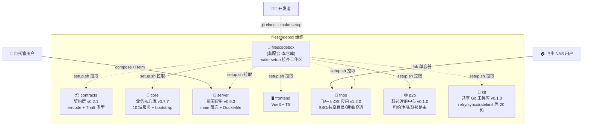
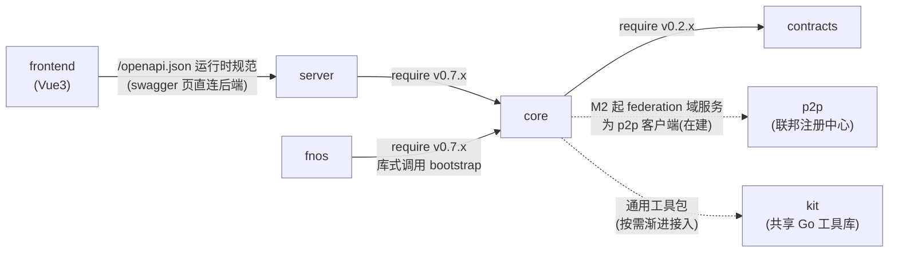
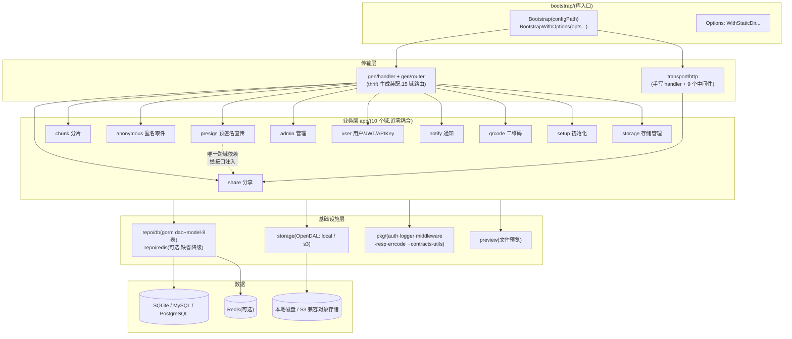
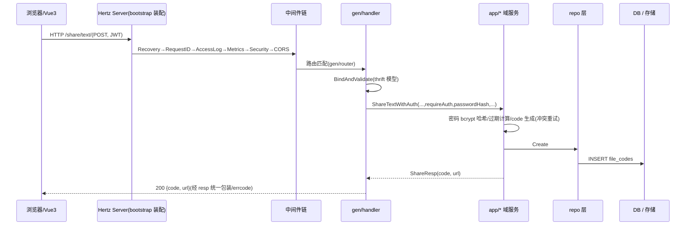
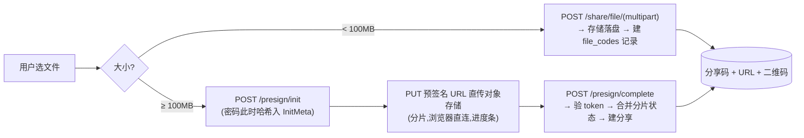
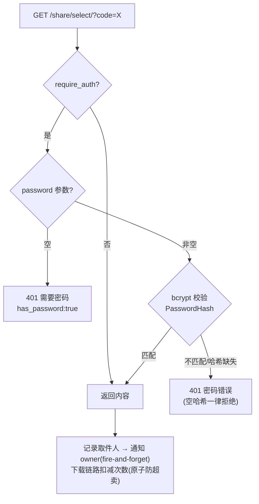
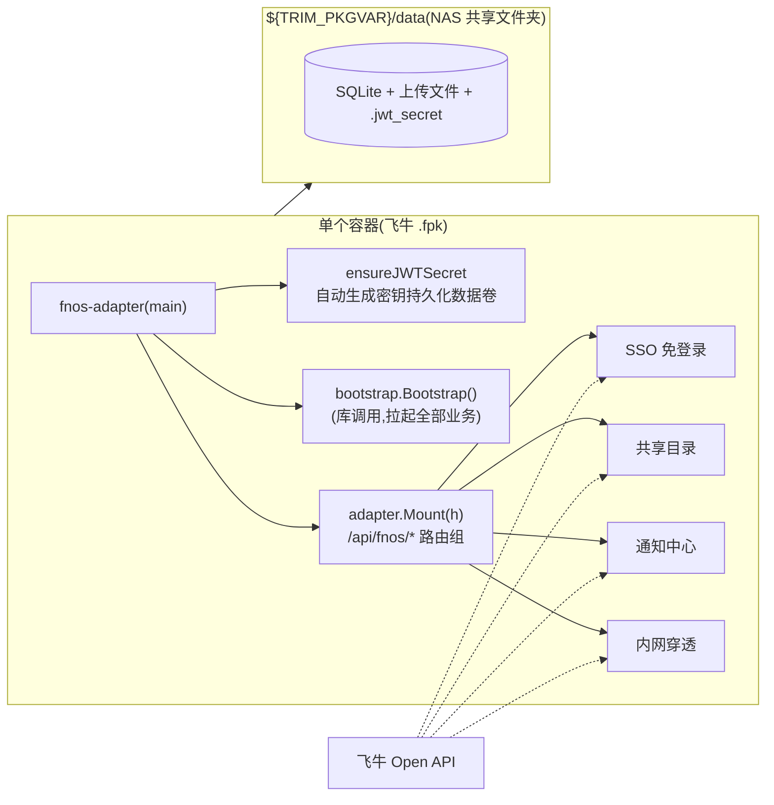
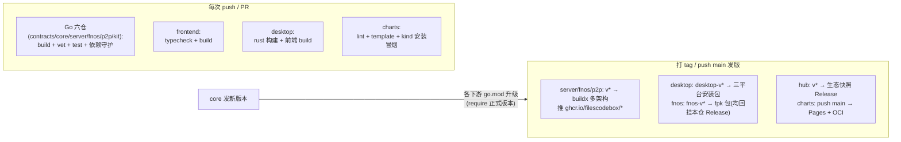

# FilesCodeBox 架构文档

> 装配仓的架构总览:生态全景、仓库依赖、core 内部分层、运行时请求流、数据流、部署形态与发布流水线。
> 所有图均为 Mermaid,GitHub 原生渲染。版本与仓库角色速查见 [README](../README.md)。

---

## 1. 生态全景



**职责边界**:装配仓不含业务代码,只提供工作区装配(`setup.sh`/`go.work`/`Makefile`/`docker-compose.yml`);七个模块仓库(经 setup.sh 拉取)与 desktop(桌面客户端)、charts(Helm Chart)两个产物仓独立开发、独立 CI、独立发版。

---

## 2. 仓库依赖关系

### 2.1 依赖图(构建期,单向无环)



### 2.2 依赖规则(CI 强制守护)

| 规则 | 守护方式 |
|------|---------|
| contracts 零项目内依赖(纯类型,仅 thrift runtime + 标准库) | contracts CI:`go list -deps` 检查 |
| p2p / kit 叶子仓零生态依赖(禁 import 任何兄弟模块) | p2p / kit CI dep guard:`go list -deps` 检查 |
| core 不许 import server / frontend / fnos | core CI 同上 |
| server / fnos 只经 go.mod 正式版本引用 core,**零 replace** | 各仓 go.mod 无 replace(本地联编由本仓 go.work 承担) |
| frontend 走后端运行时 OpenAPI 规范(`/openapi.json`),不再维护快照/生成类型 | swagger 页与 vite 代理均直连后端同源(2026-10-04 移除漂移快照) |

### 2.3 版本矩阵

| 仓库 | 当前版本 | 说明 |
|------|---------|------|
| contracts | v0.2.1 | thrift v0.13 生成代码,版本约束以 require 传递(下游零 replace) |
| core | v0.7.7 | 存储 S3 env 映射/寄件码通知/API Token/多文件+zip/OIDC/openapi 运行时生成/本地文件管理;M2 federation 域服务在建 |
| server | v0.9.3 | 纯后端镜像;frontend 分离镜像由同一 `v*` tag 同步发布(`ghcr.io/filescodebox/server` / `frontend`) |
| fnos | v1.2.0(内置 core v0.7.6) | 镜像 `ghcr.io/filescodebox/fnos`(旧镜像 `filescodebox-fnos` 冻结在 v0.2.6,更早 `filecodebox-fnos` 冻结在 v0.2.1) |
| p2p | v0.1.0 | 叶子仓零生态依赖;镜像 `ghcr.io/filescodebox/p2p`(新建包自动 public) |
| kit | v0.1.0 | 共享 Go 工具库(20 包,零生态依赖叶子仓);纯库仓无镜像,`go get github.com/filescodebox/kit/<包名>` 消费 |
| desktop | desktop-v1.2.0 | Tauri 2 桌面客户端;三平台安装包回挂本仓 Release(`desktop-v*` tag) |
| charts | chart 1.3.x(app v0.9.3) | `filecodebox` chart:1.2.x 起内置数据面,1.3.x 增内置 S3 对象存储;Pages + OCI 双发布 |

---

## 3. core 内部分层架构



**分层纪律**(继承原 internal 设计):业务层不依赖传输协议、不直接操作数据库(经 repo);域与域之间不互相 import(presign→share 唯一例外,经接口注入)。

### 3.1 全局中间件链(顺序敏感)

```
Recovery → RequestID → AccessLog → Metrics → SecurityHeaders → CORS → handler
(panic→500) (trace_id)  (结构化日志) (RED指标)  (安全响应头)     (跨域)
```

---

## 4. 运行时请求流



**关键路径**:`/live` `/ready` 健康检查、`/metrics` Prometheus(9090 独立端口)、静态资源(StaticDir 选项,SPA fallback)均在 bootstrap 层注册,不经过业务。

---

## 5. 关键数据流

### 5.1 文件上传(双路径)



### 5.2 取件与密码保护(v0.2.0 修复后)



### 5.3 飞牛 fnOS 形态(单容器库式调用)



凭证缺失时 adapter 进入**降级模式**:`/api/fnos/*` 返回 503,业务全部正常。

---

## 6. 部署形态对比

| | server(自托管) | fnos(飞牛) |
|---|---|---|
| 进程 | 1 个二进制(main → core) | 1 个二进制(adapter → core) |
| 前端 | 无(0.9.0 起纯后端镜像;分离部署由 frontend 镜像承担静态+反代) | 同镜像复用 core 静态服务(StaticDir) |
| 配置 | config.yaml + FCB_* env | FNOS_* env + 飞牛向导变量 |
| JWT 密钥 | FCB_JWT_SECRET 必填(强校验) | 自动生成并持久化(装机即用) |
| 数据 | docker volume | NAS 共享目录(用户可见可备份) |
| 镜像 | ghcr.io/filescodebox/server | ghcr.io/filescodebox/fnos |

Kubernetes 形态（charts/filecodebox，chart 1.3.x，1.2.x 起可选内置数据面）为**前后端分离两容器**：`frontend` Deployment（ghcr.io/filescodebox/frontend，nginx 静态资源 + API 反代，无状态）+ `server` Deployment（API/数据，携带 PVC），Ingress 指向 frontend Service、API 由其反代后端；两镜像由 server 仓 release 工作流以同一 `v*` tag 同步发布（与 chart appVersion 单点对齐）。

---

## 7. CI / 发布流水线



**发版流程**:core 改动 → tag(core vX)→ server/fnos `go mod edit -require core@vX` → commit → 打自身 tag → CI 自动出镜像。全程无需 replace。

---

## 8. 技术栈

| 层 | 技术 |
|----|------|
| 后端 | Go 1.26 · CloudWeGo Hertz · GORM(SQLite/MySQL/Postgres) · go-redis(可选) |
| 契约 | Thrift IDL(v0.13 生成,require 传递版本约束) · OpenAPI 3 |
| 存储 | OpenDAL(local / S3 兼容) |
| 前端 | Vue 3 · TypeScript · Vite · Element Plus · Pinia · openapi-typescript |
| 可观测 | zap 结构化日志 · Prometheus RED 指标 · X-Trace-Id 链路 |
| 安全 | bcrypt 分享密码 · JWT + API Key · CORS 白名单 · 限流(Redis/内存) · 安全响应头 |
| 构建 | Docker 三阶段 · GitHub Actions(多架构) · ghcr |
