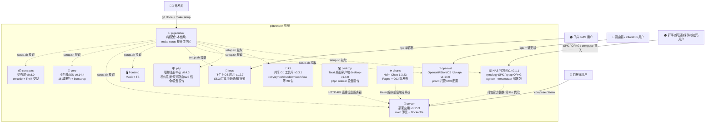
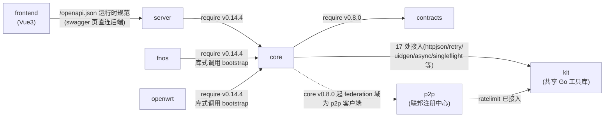
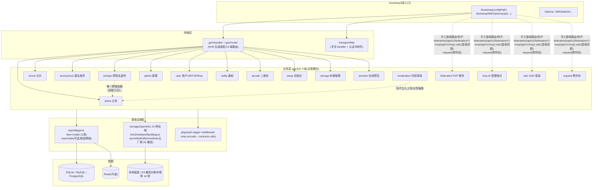
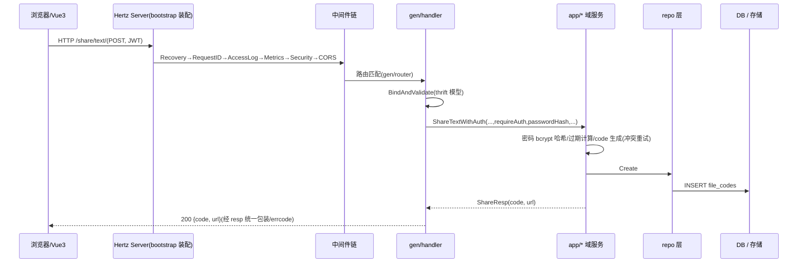
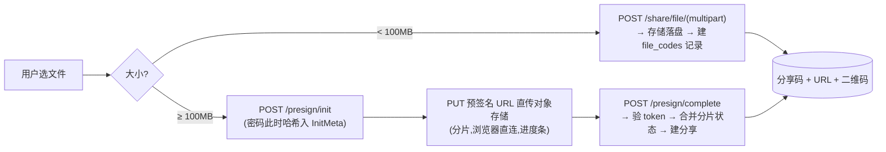
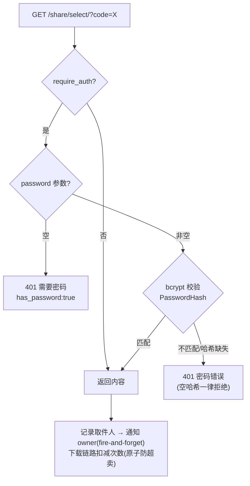
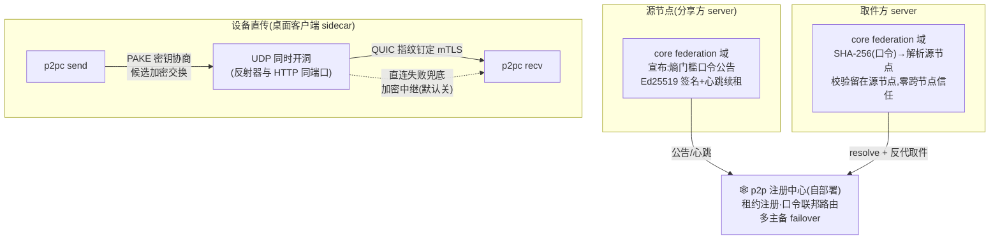
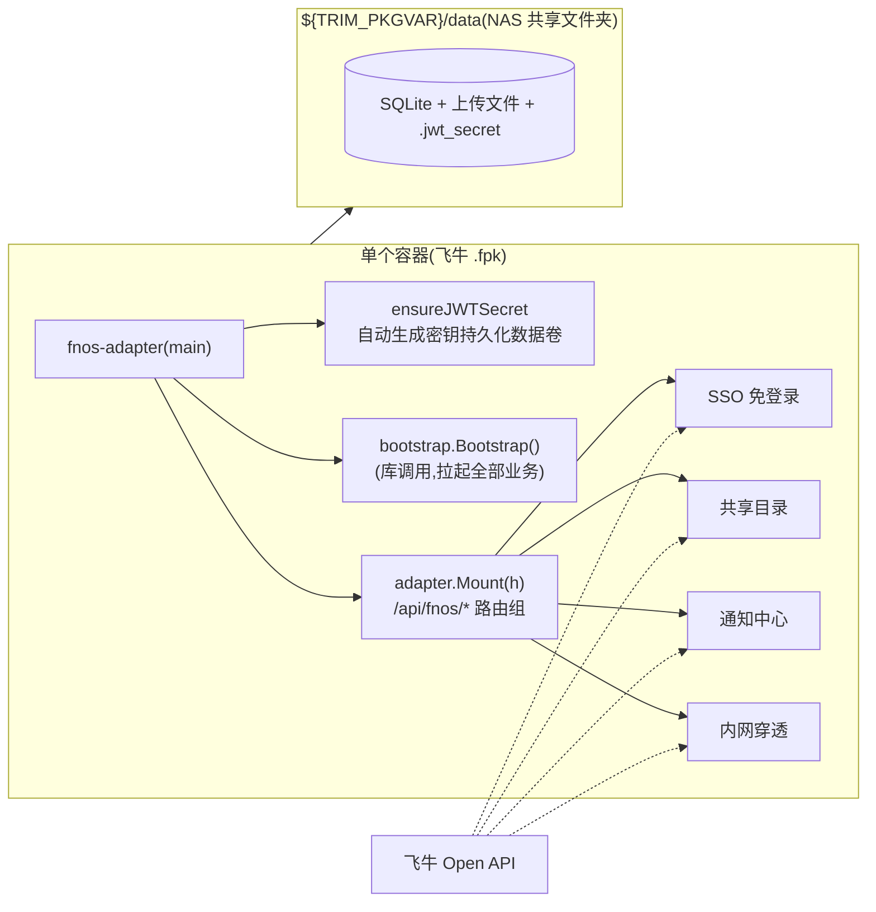
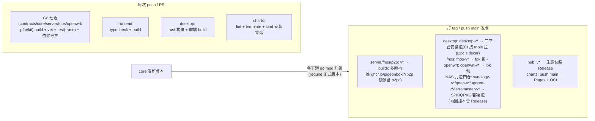

# PigeonBox 架构文档

> 装配仓的架构总览:生态全景、仓库依赖、core 内部分层、运行时请求流、数据流、部署形态与发布流水线。
> 所有图均为 Mermaid,GitHub 原生渲染。版本与仓库角色速查见 [README](../README.md)。

---

## 1. 生态全景



**职责边界**:装配仓不含业务代码,只提供工作区装配(`setup.sh`/`go.work`/`Makefile`/`docker-compose.yml`);十二个模块仓库(经 setup.sh 拉取, 含 NAS 打包四仓 synology/qnap/ugreen/terramaster)与 desktop(桌面客户端,Rust 项目不入 go.work)、charts(Helm Chart)两个产物仓独立开发、独立 CI、独立发版。

---

## 2. 仓库依赖关系

### 2.1 依赖图(构建期,单向无环)



desktop 不进 go.work(Rust 项目),经 HTTP API 连接任意 PigeonBox 服务器,无构建期依赖。

### 2.2 依赖规则(CI 强制守护)

| 规则 | 守护方式 |
|------|---------|
| contracts 零项目内依赖(纯类型,仅 thrift runtime + 标准库) | contracts CI:`go list -deps` 检查 |
| kit 零生态依赖(禁 import 任何兄弟模块);p2p 业务链零依赖(kit 地基层放行) | kit / p2p CI dep guard:`go list -deps` 检查 |
| core 不许 import server / frontend / fnos | core CI 同上 |
| server / fnos 只经 go.mod 正式版本引用 core,**零 replace** | 各仓 go.mod 无 replace(本地联编由本仓 go.work 承担) |
| frontend wire 契约类型经 `@pigeonbox/contracts`(contracts IDL 生成的 TS d.ts,Release tgz 资产依赖);运行时 `/openapi.json` 仍是 API 规范真相源,快照不维护 | contracts CI `--check` 对账生成物;swagger 页与 vite 代理均直连后端同源(2026-10-04 移除漂移快照) |

### 2.3 版本矩阵

| 仓库 | 当前版本 | 说明 |
|------|---------|------|
| contracts | v0.8.0 | thrift v0.13 生成代码,版本约束以 require 传递(下游零 replace);IDL 真相源 `idl/`,前端 TS 类型经 `cmd/gen-ts` → Release tgz |
| core | v0.14.7 | 16 域服务;**v0.14.0=单机内存模式(redis.host 空=进程内 KV,回源 DB+负缓存防穿透;public/admin 缺 Redis fail-fast)**;v0.13.0=FCB_DEPLOY_MODE 三模式部署拆分(standalone/public×N/admin×1,Redis 配置广播)+回收站;v0.11.x=HttpOnly Cookie 会话(CSRF 头门禁)+审计清欠+攻击面收缩;v0.10.0=全面安全审计加固(管理面/chunk 链路/JWT 纪元·封禁改密即时失效/纵深防御);v0.9.0=federation M4(registry 多主备 failover+心跳短退避);v0.8.x=federation 接入+kit 化;v0.7.x=API Token/多文件+zip/OIDC/寄件码/运行时 OpenAPI |
| server | v0.15.6 | **v0.15.x=单机内存模式列车(core v0.14.0)**;v0.14.x=多副本拆分列车(core v0.13.0,FCB_DEPLOY_MODE);纯后端镜像(默认 release 模式,alpine 钉 3.22);frontend 分离镜像由同一 `v*` tag 同步发布(`ghcr.io/pigeonbox/server` / `frontend`) |
| fnos | v1.14.2(内置 core v0.14.7) | 镜像 `ghcr.io/pigeonbox/fnos`(旧镜像 `pigeonbox-fnos` 冻结在 v0.2.6,更早 `pigeonbox-fnos` 冻结在 v0.2.1) |
| openwrt | v1.14.2(内置 core v0.14.7) | OpenWrt/iStoreOS 原生 ipk:procd 托管,UCI 配置(`/etc/config/pigeonbox`)+drop-in config.yaml,双架构 x86_64/aarch64_generic;ipk 回挂 hub Release(`openwrt-v*`) |
| NAS 打包四仓 | v1.14.2(钉 server/frontend 镜像 v0.15.6) | synology SPK(noarch,DSM 7.2+ Container Manager)/ qnap QPKG(x86_64+arm_64,QDK qbuild)/ ugreen·terramaster compose 部署包(UPK/TOS7 应用包送审二期);纯 shell 零 Go,编排=双容器免 Redis;包回挂 hub Release(各 `*-v*` tag) |
| p2p | v0.4.4 | v0.3.x=M3 设备直传全量(p2pc)+六平台二进制;v0.4.0=wire AEAD/注册 token/中继限流安全加固;v0.4.1=p2pc 修复;镜像 `ghcr.io/pigeonbox/p2p`(含 p2pc) |
| kit | v0.3.1 | 共享 Go 工具库(28 包);已被 core(17 处)、p2p(ratelimit)、fnos/server(version) 消费;纯库仓无镜像,`go get github.com/pigeonbox/kit/<包名>` |
| desktop | desktop-v1.14.2 | Tauri 2 桌面客户端+**p2pc sidecar 设备直传**(p2pc 0.4 传输协议 v2,与旧版服务端/客户端互不兼容需双端同版);三平台安装包回挂本仓 Release(`desktop-v*` tag) |
| charts | chart 2.0.4(app v0.15.6) | `pigeonbox` chart:1.2.x 起内置数据面,1.3.x 增内置 S3(SeaweedFS),1.3.4 增 p2p 可选组件,1.3.7 增直传中继开关,**1.3.22 增多副本双拓扑(FCB_DEPLOY_MODE)**;Pages + OCI 双发布 |

---

## 3. core 内部分层架构



**分层纪律**(继承原 internal 设计):业务层不依赖传输协议、不直接操作数据库(经 repo);域与域之间不互相 import(presign→share 唯一例外,经接口注入;moderation 以钩子注入,不算 import)。

> 域到路由的两种挂法:share/chunk/preview 等走 gen 生成路由;federation/mcp/oidc/request 在 bootstrap 手工注册(mcp 为 JSON-RPC 2.0 单端点,非 REST)。

### 3.1 全局中间件链(顺序敏感)

```
Recovery → RequestID → AccessLog → Metrics → SecurityHeaders → CORS → handler
(panic→500) (trace_id)  (结构化日志) (RED指标)  (安全响应头)     (跨域)
```

Metrics 默认绑定 `127.0.0.1:9090`(可用 `FCB_METRICS_ADDR` 配置),仅供同节点 Prometheus 抓取。

---

## 4. 运行时请求流



**关键路径**:`/live` `/ready` 健康检查、`/metrics` Prometheus、静态资源(StaticDir 选项,SPA fallback)均在 bootstrap 层注册,不经过业务。另有 `POST /api/v1/mcp` 单端点(JSON-RPC 2.0,管理员 token)供 AI 客户端(Claude Desktop 等)执行建分享/查询/清理等管理操作。

---

## 5. 关键数据流

### 5.1 文件上传(双路径)



### 5.2 取件与密码保护(v0.2.0 修复后)



### 5.3 P2P 联邦与设备直传(可选,默认关)



### 5.4 飞牛 fnOS 形态(单容器库式调用)



凭证缺失时 adapter 进入**降级模式**:`/api/fnos/*` 返回 503,业务全部正常。

---

## 6. 部署形态对比

| | server(自托管) | fnos(飞牛) | openwrt(路由器) | desktop(桌面) |
|---|---|---|---|---|
| 进程 | 1 个二进制(main → core) | 1 个二进制(adapter → core) | 1 个二进制(core,procd 托管+开机自启) | Tauri 常驻托盘(+p2pc sidecar) |
| 前端 | 无(0.9.0 起纯后端镜像;分离部署由 frontend 镜像承担静态+反代) | 同镜像复用 core 静态服务(StaticDir) | 前端 dist 内置于 ipk,单端口 12345 同端口服务 | 连接任意服务器 URL,无本地前端服务 |
| 配置 | config.yaml + FCB_* env | FNOS_* env + 飞牛向导变量 | UCI(`/etc/config/pigeonbox`)+drop-in config.yaml | 连接配置本地保存 |
| JWT 密钥 | FCB_JWT_SECRET 必填(强校验) | 自动生成并持久化(装机即用) | 自动生成并持久化(装机即用) | 不持有(服务端事务) |
| 数据 | docker volume | NAS 共享目录(用户可见可备份) | `/etc/pigeonbox/`(卸载保留) | 服务端存储;直传端到端加密 |
| 镜像/制品 | ghcr.io/pigeonbox/server | ghcr.io/pigeonbox/fnos | `openwrt-v*` ipk(x86_64/aarch64_generic,hub Release) | `desktop-v*` 安装包(hub Release) |

**NAS 打包四仓**（synology/qnap/ugreen/terramaster，2026-10-07 起）覆盖群晖 DSM 7.2+（noarch SPK，Container Manager 编排）、威联通 QTS 5+（QPKG 双架构，Container Station 编排）、绿联 UGOS Pro 与铁威马 TOS 5/6/7（compose 项目导入部署包，UPK/官方应用包送审为二期）：统一打包 ghcr 官方镜像的 docker-compose 编排（双容器免 Redis 单机内存模式），零 Go 代码，数据落卷/共享目录，制品以 `synology-v*`/`qnap-v*`/`ugreen-v*`/`terramaster-v*` tag 回挂本仓 Release。

Kubernetes 形态（charts 仓 `charts/pigeonbox`）为**前后端分离两容器**：`frontend` Deployment（ghcr.io/pigeonbox/frontend，nginx 静态资源 + API 反代，无状态）+ `server` Deployment（API/数据，携带 PVC），Ingress 指向 frontend Service、API 由其反代后端；两镜像由 server 仓 release 工作流以同一 `v*` tag 同步发布。chart 另提供可选内置组件：数据面（Redis 默认开，MySQL/PostgreSQL 可选）、内置 S3 对象存储（`s3.enabled=true`，SeaweedFS 单进程）、p2p 联邦注册中心（`p2p.enabled=true`，1.3.7 起含直传中继开关）——均默认关闭。

**多副本拆分**（chart 1.3.22+ / server ≥ 0.14.0，`replicaCount > 1`）：同一镜像以 `FCB_DEPLOY_MODE` 切三种运行形态——`standalone`（默认，单进程全功能，即上表形态）/ `public`（公开面路由 ×N，管理路径物理 404，不跑迁移与后台任务）/ `admin`（管理面 + 后台任务 + DB 迁移 + 配置唯一写者，全局 1 实例）。管理端配置/存储变更经 Redis pubsub + revision 对账秒级同步到全部 public 副本；公网入口只指 public 面，admin 面走独立 Ingress（白名单）或 port-forward。硬约束：MySQL/PG + Redis 必配、存储 S3 或 RWX 卷、federation 自动降级（节点身份是进程级密钥）。设计详见 `docs/specs/2026-10-06-multi-replica-deployment-modes.md`。

---

## 7. CI / 发布流水线



**发版流程**:core 改动 → tag(core vX)→ server/fnos `go mod edit -require core@vX` → commit → 打自身 tag → CI 自动出镜像。全程无需 replace。p2p 自 v0.3.1 起随 Release 发布 p2pc 六平台二进制(命名=Tauri target triple),desktop 仓 CI 按平台拉取作 sidecar 打进安装包。

---

## 8. 技术栈

| 层 | 技术 |
|----|------|
| 后端 | Go 1.26 · CloudWeGo Hertz · GORM(SQLite/MySQL/Postgres) · go-redis(可选) |
| 契约 | Thrift IDL(v0.13 生成,require 传递版本约束) · OpenAPI 3(后端运行时生成 `/openapi.json`) |
| 存储 | OpenDAL 统一抽象,14 种后端(local / S3 兼容及各云厂商 / webdav / ftp / sftp / gcs / azureblob / hdfs / onedrive) |
| 前端 | Vue 3 · TypeScript · Vite · Element Plus · Pinia(wire 契约类型经 `@pigeonbox/contracts`;API 规范真相源=后端运行时 `/openapi.json`) |
| 可观测 | zap 结构化日志 · Prometheus RED 指标 · X-Trace-Id 链路 |
| 安全 | bcrypt 分享密码 · JWT(JWT 纪元+封禁/改密即时失效) + API Key · OIDC SSO · CORS 白名单 · 限流(Redis/内存) · 安全响应头(CSP) · 内容审核钩子(敏感词/ClamAV) · MCP 管理端点(管理员 token) |
| 端到端 | p2pc 设备直传(PAKE + QUIC mTLS + 加密中继兜底 + AEAD 断点续传) |
| 构建 | Docker 三阶段 · GitHub Actions(多架构) · ghcr |
